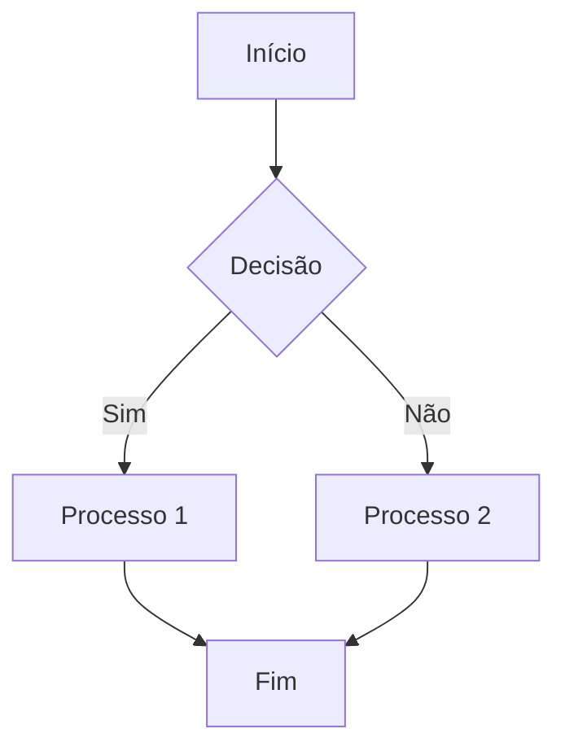
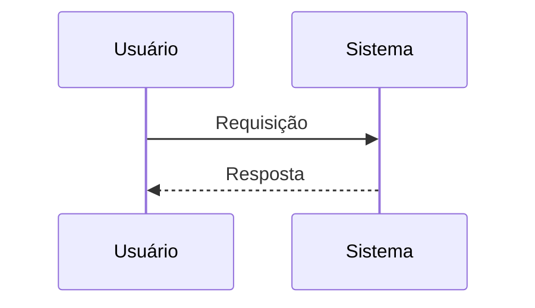

# 📊 Diagramas Mermaid para Arquitetura de Software

## 🎯 Sobre este Projeto

Este repositório serve como um guia completo para o uso de diagramas Mermaid na documentação de arquitetura de software. O Mermaid é uma ferramenta poderosa que permite criar diagramas e visualizações usando texto e código, tornando-o ideal para manter diagramas em repositórios Git.

## 📚 Índice

- [Introdução ao Mermaid](#introdução-ao-mermaid)
- [Tipos de Diagramas](#tipos-de-diagramas)
- [Instalação e Uso](#instalação-e-uso)
- [Exemplos](#exemplos)
- [Boas Práticas](#boas-práticas)


## 🚀 Introdução ao Mermaid

Mermaid é uma ferramenta de diagramação e gráficos baseada em JavaScript que renderiza definições de texto inspiradas em Markdown para criar e modificar diagramas dinamicamente. Suas principais vantagens incluem:

- **Versionamento**: Os diagramas são baseados em texto, facilitando o controle de versão
- **Manutenibilidade**: Fácil de atualizar e modificar
- **Integração**: Suporte nativo no GitHub e outras plataformas
- **Colaboração**: Múltiplos desenvolvedores podem trabalhar nos mesmos diagramas
- **Automação**: Possibilidade de gerar diagramas programaticamente

## 🎨 Tipos de Diagramas

Este repositório contém exemplos dos seguintes tipos de diagramas:

1. **[Fluxograma](examples/flowchart.md)** (`flowchart.md`)
   - Ideal para processos e fluxos de trabalho

2. **[Sequência](examples/sequence.md)** (`sequence.md`)
   - Perfeito para interações entre componentes

3. **[Classes](examples/class.md)** (`class.md`)
   - Ótimo para modelagem de domínio e estruturas de dados

4. **[Estado](examples/state.md)** (`state.md`)
   - Excelente para máquinas de estado e fluxos de usuário

5. **[Entidade Relacionamento](examples/er.md)** (`er.md`)
   - Ideal para modelagem de banco de dados

6. **[Gantt](examples/gantt.md)** (`gantt.md`)
   - Perfeito para planejamento de projetos

7. **[Pie](examples/pie.md)** (`pie.md`)
   - Útil para visualização de dados

8. **[Arquitetura C4](examples/c4.md)** (`c4.md`)
   - Específico para documentação de arquitetura de software

## 🛠 Instalação e Uso

### Uso no GitHub

O Mermaid é suportado nativamente no GitHub. Basta criar um bloco de código com a linguagem `mermaid`:

\```mermaid
graph TD
    A[Cliente] --> B[Servidor]
    B --> C[Banco de Dados]
\```

### Uso Local

1. **VS Code**:
   - Instale a extensão "Markdown Preview Mermaid Support"

2. **Node.js**:
   ```bash
   npm install -g @mermaid-js/mermaid-cli
   ```

3. **Docker**:
   ```bash
   docker run --rm -v $(pwd):/data minlag/mermaid-cli
   ```

## 📝 Exemplos

Cada tipo de diagrama possui seu próprio arquivo de exemplo na pasta `/examples`. Os exemplos incluem:

- Casos de uso comuns
- Sintaxe detalhada
- Melhores práticas
- Dicas de estilização

## ✨ Boas Práticas

1. **Nomenclatura**
   - Use nomes descritivos para nós
   - Mantenha consistência nos padrões

2. **Organização**
   - Divida diagramas complexos
   - Use subgraphs para agrupar

3. **Estilização**
   - Mantenha um esquema de cores consistente
   - Use estilos para melhorar legibilidade

4. **Documentação**
   - Adicione comentários nos diagramas
   - Mantenha uma legenda quando necessário


## 🔗 Links Úteis

- [Documentação Oficial Mermaid](https://mermaid-js.github.io/mermaid/#/)
- [Editor Live Mermaid](https://mermaid.live/)
- [Integração GitHub](https://github.blog/2022-02-14-include-diagrams-markdown-files-mermaid/)
- [Awesome Mermaid](https://github.com/mermaid-js/awesome-mermaid)

## 📊 Exemplos de Uso

### Fluxograma Básico


### Diagrama de Sequência


### Diagrama de Classes
```mermaid
classDiagram
    class Animal {
        +nome: string
        +fazerSom()
    }
    class Cachorro {
        +latir()
    }
    Animal <|-- Cachorro
``` # diagrams-mermaid
