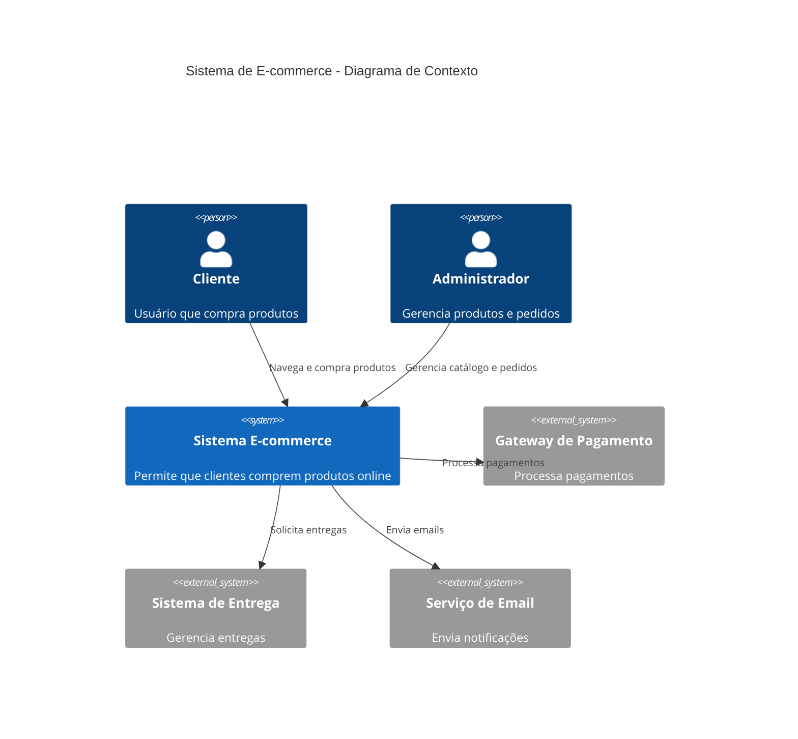
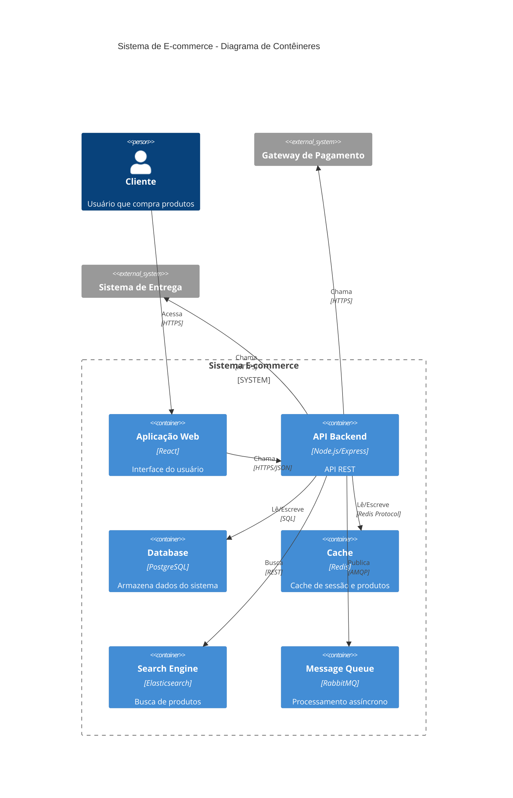
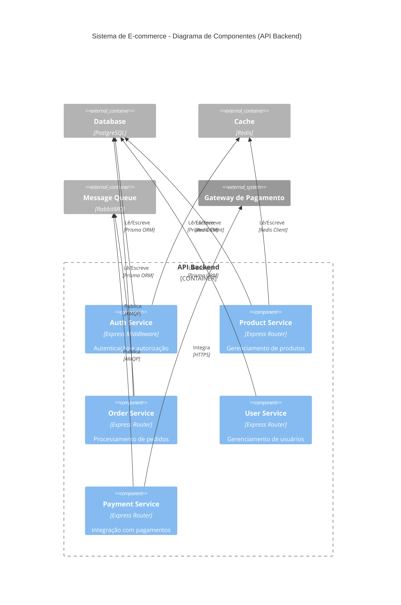
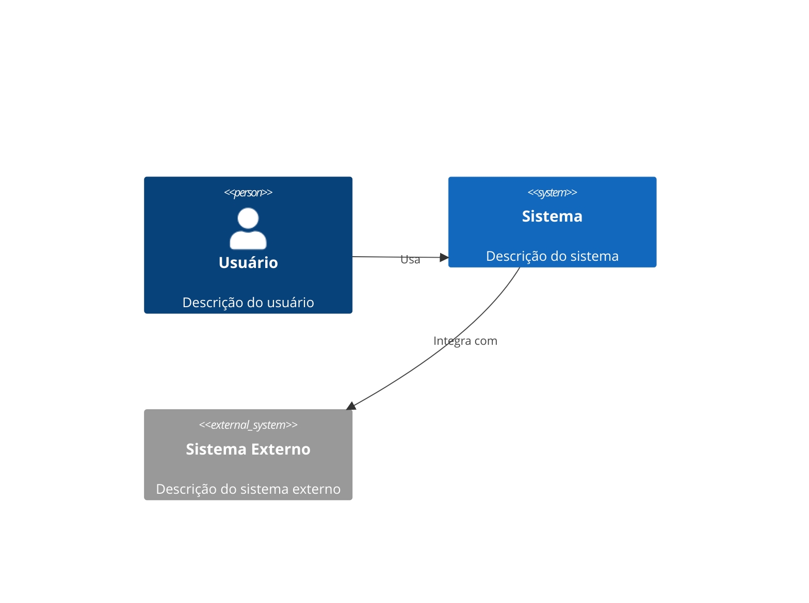
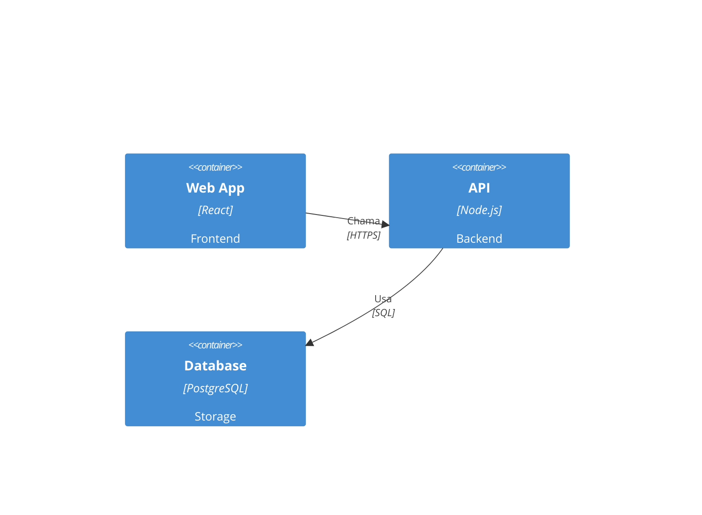
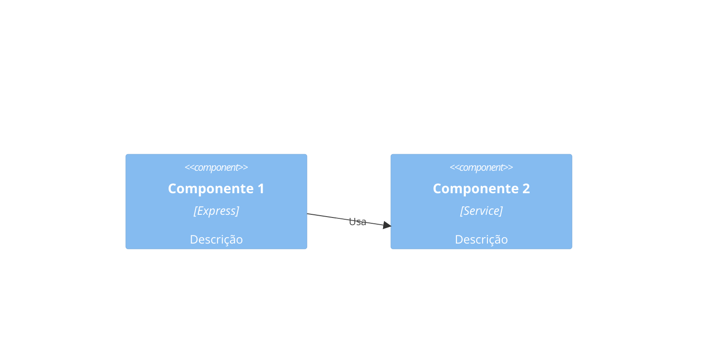

# Diagramas C4 com Mermaid

Os diagramas C4 são uma abordagem para documentar arquitetura de software em diferentes níveis de abstração: Contexto, Contêineres, Componentes e Código.

## Exemplo de Contexto: Sistema E-commerce

## Exemplo de Contêineres: Arquitetura do Sistema

## Exemplo de Componentes: API Backend

## Sintaxe Básica

### Pessoas e Sistemas

### Contêineres

### Componentes

## Boas Práticas

1. **Níveis de Abstração**
   - Comece com contexto
   - Detalhe gradualmente
   - Mantenha consistência

2. **Clareza**
   - Use nomes descritivos
   - Inclua tecnologias
   - Explique relacionamentos

3. **Organização**
   - Agrupe elementos relacionados
   - Use boundaries
   - Mantenha layout limpo

4. **Detalhamento**
   - Inclua protocolos
   - Especifique tecnologias
   - Documente integrações

5. **Documentação**
   - Adicione descrições
   - Explique decisões
   - Mantenha atualizado 