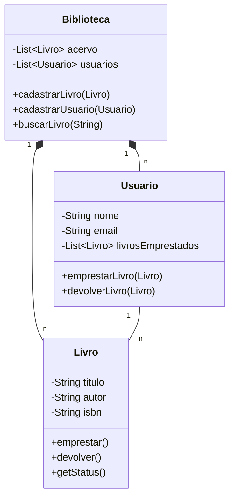
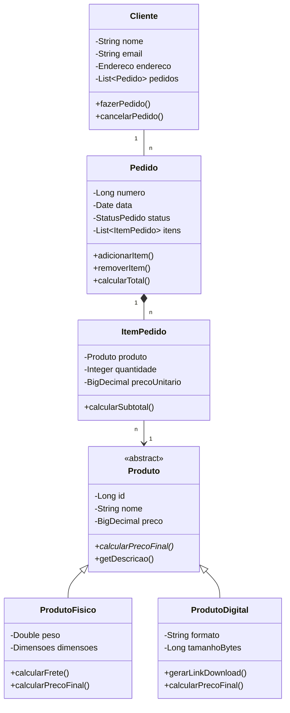
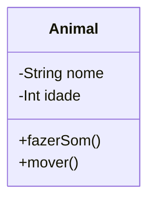
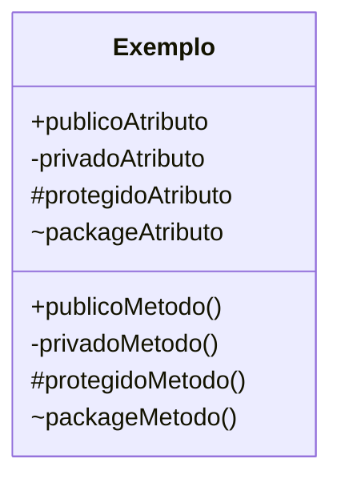
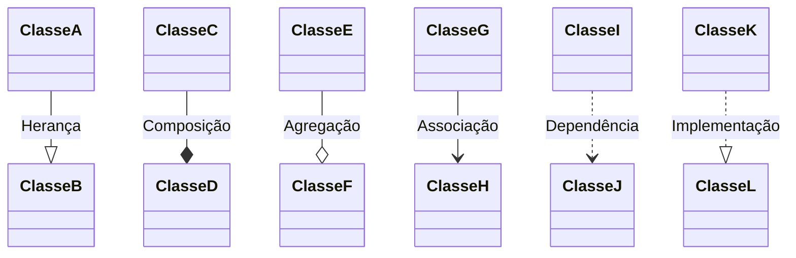
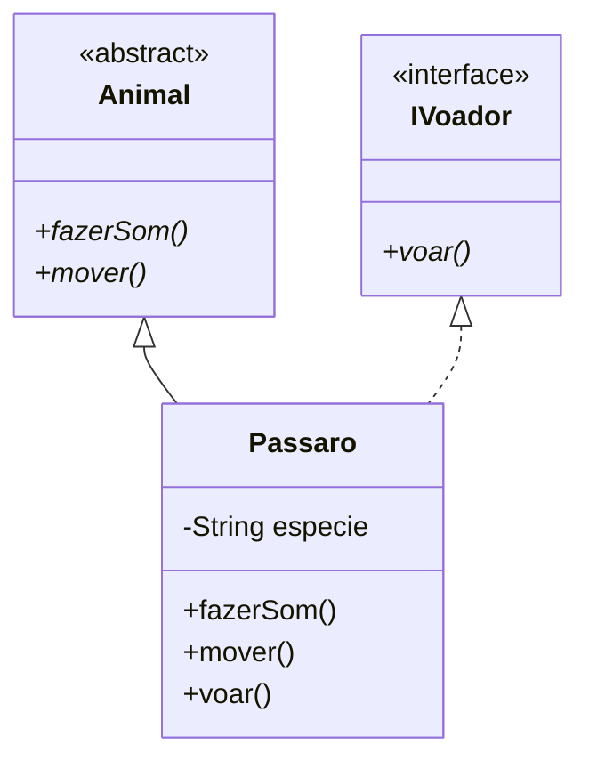
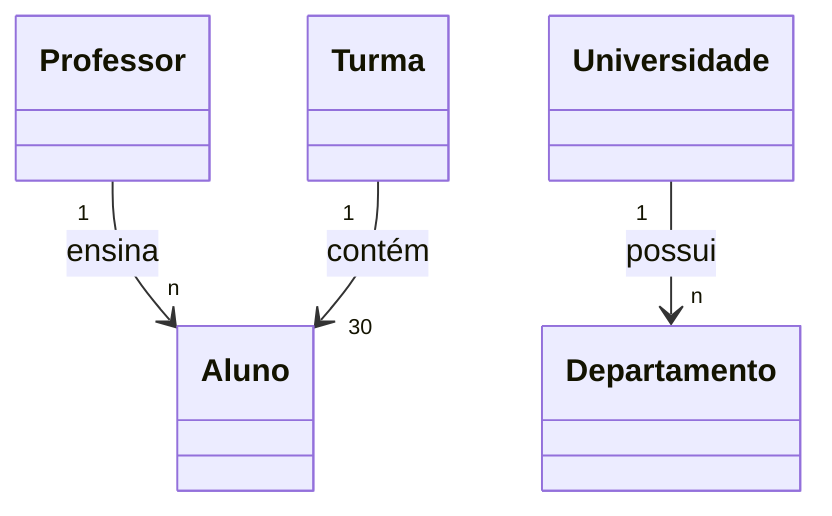

# Diagramas de Classe com Mermaid

Os diagramas de classe são fundamentais para modelagem orientada a objetos, mostrando a estrutura de classes, seus atributos, métodos e relacionamentos.

## Exemplo Básico: Sistema de Biblioteca

## Exemplo Avançado: E-commerce

## Sintaxe Básica

### Definição de Classe

### Visibilidade

### Tipos de Relacionamentos

## Recursos Avançados

### Interfaces e Classes Abstratas

### Multiplicidade

## Boas Práticas

1. **Organização**
   - Agrupe classes relacionadas
   - Mantenha relacionamentos claros
   - Use espaçamento adequado

2. **Nomenclatura**
   - Use nomes significativos
   - Siga convenções de nomenclatura
   - Seja consistente no estilo

3. **Detalhamento**
   - Inclua apenas atributos relevantes
   - Documente métodos importantes
   - Especifique tipos de dados

4. **Relacionamentos**
   - Use o tipo correto de relacionamento
   - Indique multiplicidade
   - Evite relacionamentos desnecessários

5. **Legibilidade**
   - Evite diagramas muito grandes
   - Use comentários quando necessário
   - Mantenha a simplicidade 