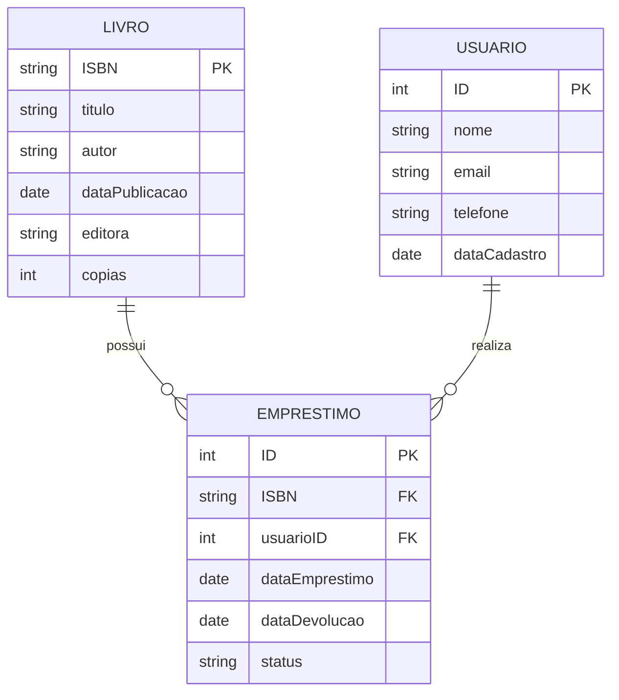
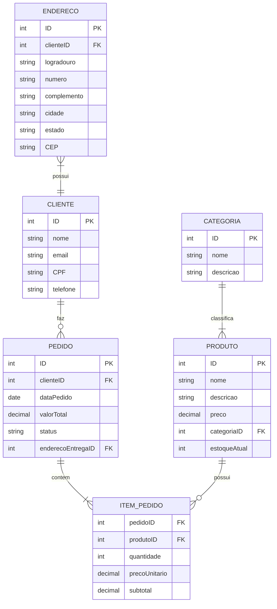
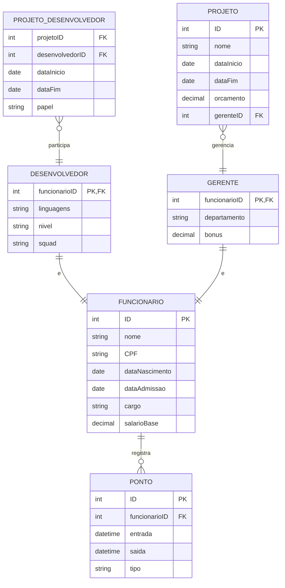
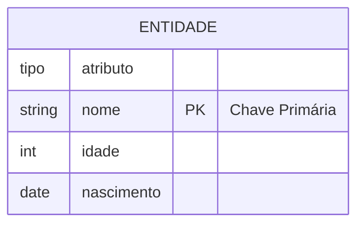
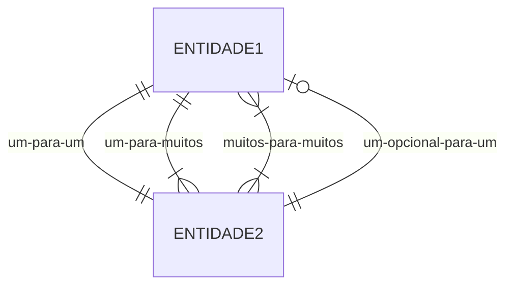
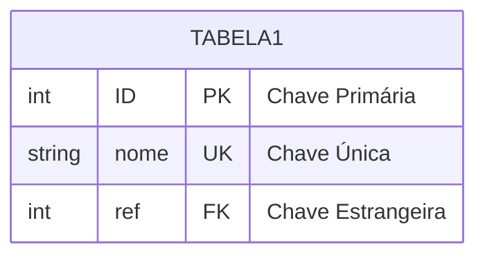
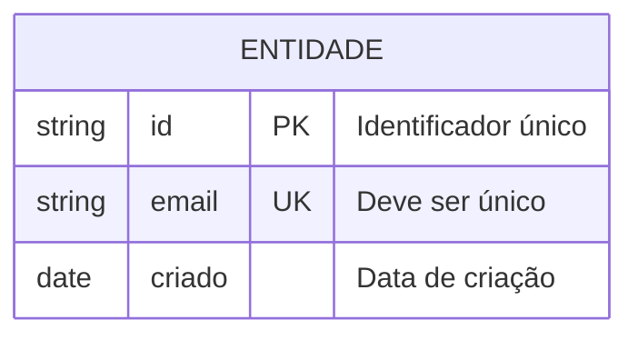

# Diagramas Entidade-Relacionamento com Mermaid

Os diagramas ER são essenciais para modelagem de banco de dados, mostrando entidades, seus atributos e relacionamentos.

## Exemplo Básico: Sistema de Biblioteca

## Exemplo Avançado: Sistema de E-commerce

## Exemplo com Herança: Sistema de RH

## Sintaxe Básica

### Entidades e Atributos

### Relacionamentos

## Recursos Avançados

### Chaves e Referências

### Comentários e Documentação

## Boas Práticas

1. **Nomenclatura**
   - Use nomes significativos
   - Mantenha padrão consistente
   - Documente campos importantes

2. **Modelagem**
   - Normalize adequadamente
   - Evite redundância
   - Defina chaves apropriadas

3. **Relacionamentos**
   - Especifique cardinalidade
   - Documente regras de negócio
   - Considere integridade referencial

4. **Documentação**
   - Adicione comentários relevantes
   - Explique regras complexas
   - Mantenha dicionário de dados

5. **Organização**
   - Agrupe entidades relacionadas
   - Mantenha diagrama legível
   - Use cores para categorização 