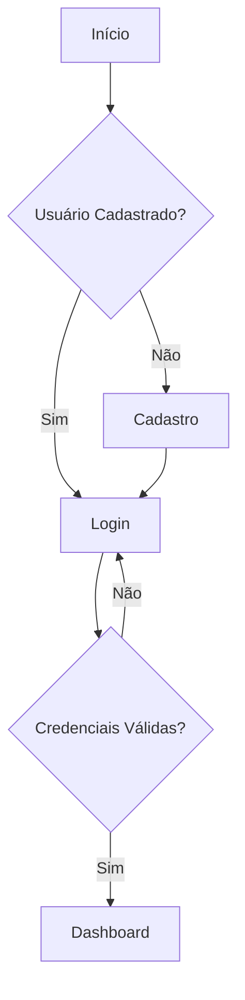
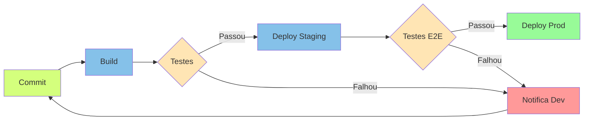
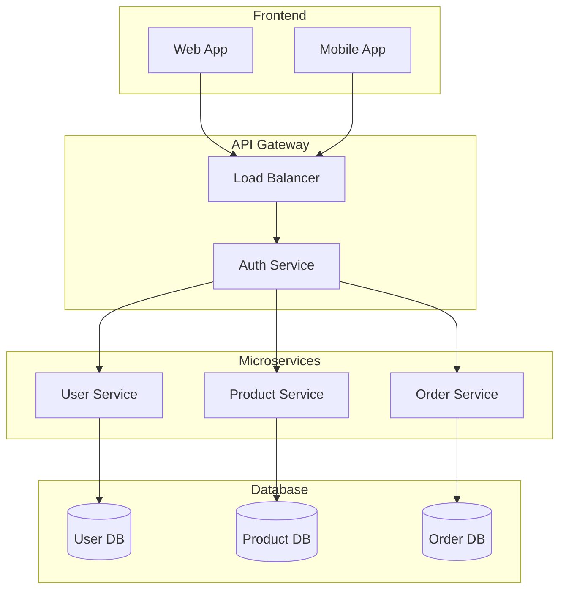
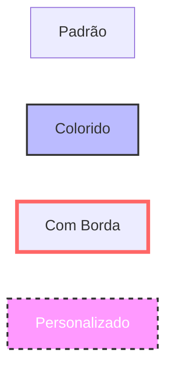
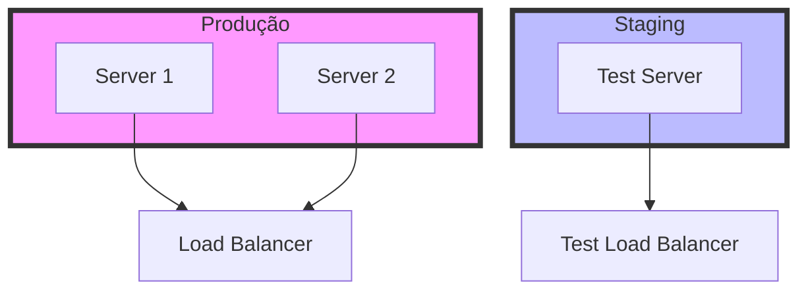

# Fluxogramas com Mermaid

Os fluxogramas são uma das funcionalidades mais utilizadas do Mermaid. Eles são perfeitos para representar processos, tomadas de decisão e fluxos de trabalho.

## Exemplo Básico: Processo de Login

## Exemplo Avançado: Pipeline de CI/CD

## Exemplo com Subgraphs: Arquitetura de Microserviços

## Sintaxe Básica

### Nós
- `A[Texto]` - Nó retangular
- `B(Texto)` - Nó arredondado
- `C{Texto}` - Nó de decisão (losango)
- `D([Texto])` - Nó em formato de estádio
- `E[(Texto)]` - Nó de cilindro (database)

### Conexões
- `-->` - Seta padrão
- `---` - Linha sem seta
- `-.->` - Linha pontilhada
- `==>` - Linha grossa
- `-->|texto|` - Seta com texto

### Direções
- `TB` - Top to Bottom
- `BT` - Bottom to Top
- `LR` - Left to Right
- `RL` - Right to Left

## Dicas de Estilização

### Cores e Estilos

### Subgraphs com Estilos

## Boas Práticas

1. **Clareza**
   - Use nomes descritivos
   - Mantenha o diagrama simples
   - Agrupe elementos relacionados

2. **Consistência**
   - Use o mesmo estilo para elementos similares
   - Mantenha um padrão de direção
   - Use cores com significado

3. **Organização**
   - Use subgraphs para agrupar logicamente
   - Alinhe elementos quando possível
   - Evite cruzamento de linhas 