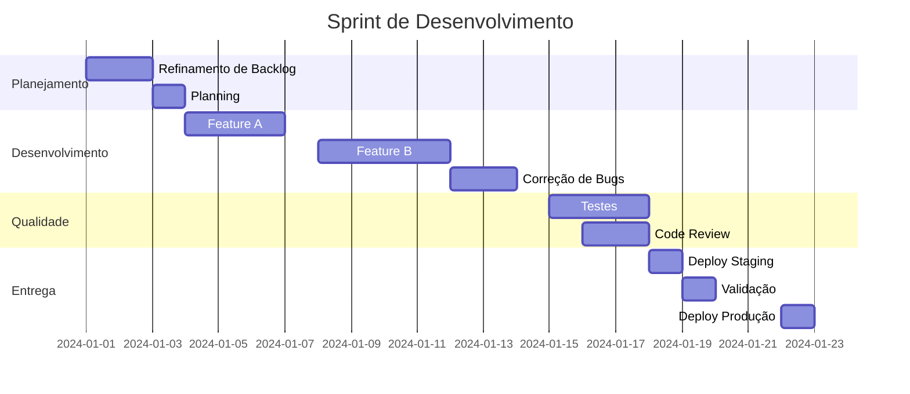
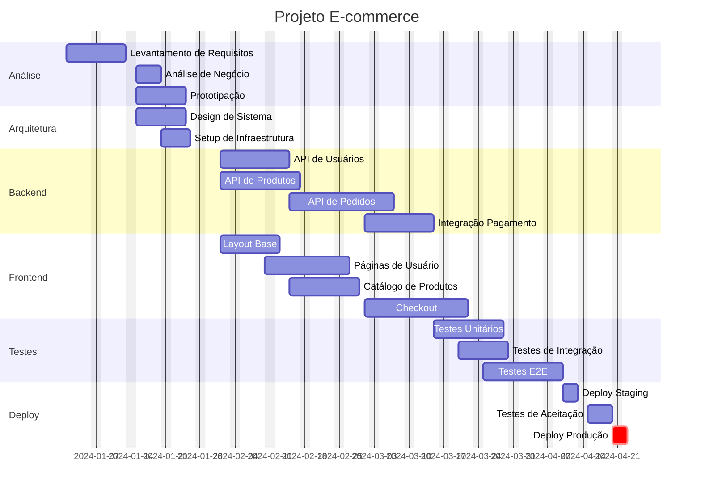
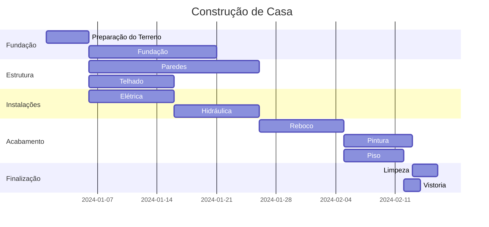
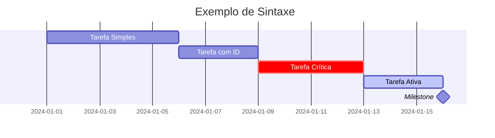
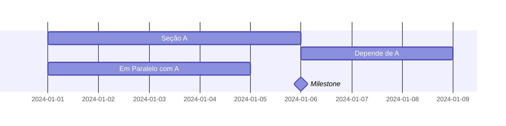
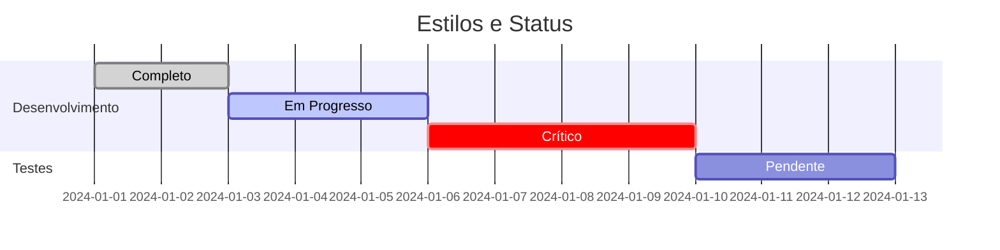
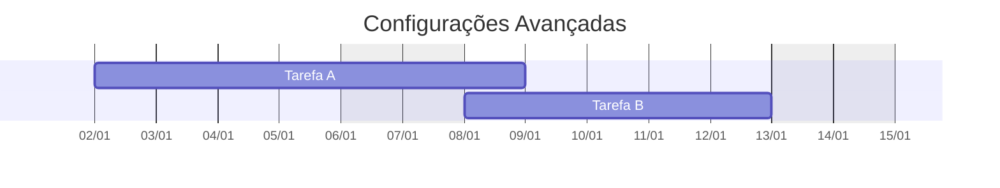

# Diagramas Gantt com Mermaid

Os diagramas Gantt são ideais para planejamento de projetos, mostrando tarefas, durações e dependências ao longo do tempo.

## Exemplo Básico: Sprint de Desenvolvimento

## Exemplo Avançado: Projeto de Software

## Exemplo com Dependências: Construção de Casa

## Sintaxe Básica

### Definição de Tarefas

### Seções e Dependências

## Recursos Avançados

### Status e Estilos

### Exclusões e Formatação

## Boas Práticas

1. **Organização**
   - Agrupe tarefas relacionadas em seções
   - Mantenha uma hierarquia clara
   - Use cores para indicar status

2. **Temporização**
   - Seja realista com as durações
   - Considere dependências
   - Inclua folgas para imprevistos

3. **Clareza**
   - Use nomes descritivos
   - Indique milestones importantes
   - Destaque caminhos críticos

4. **Manutenção**
   - Atualize regularmente
   - Monitore progresso
   - Ajuste conforme necessário

5. **Visualização**
   - Mantenha escala apropriada
   - Use formatação consistente
   - Destaque datas importantes 