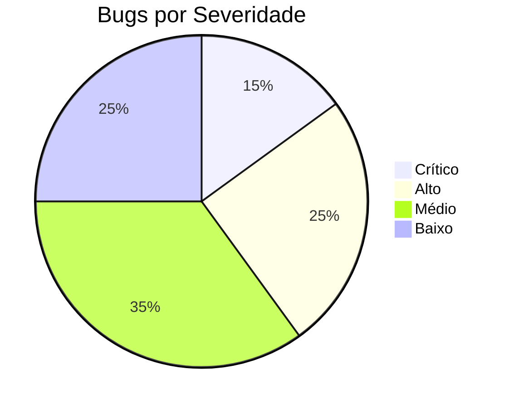
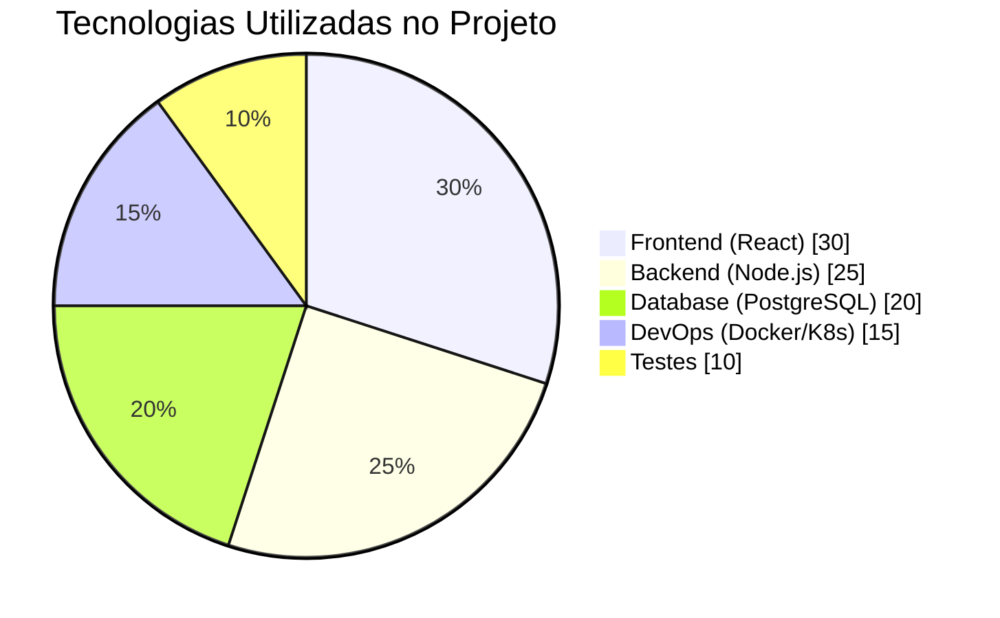
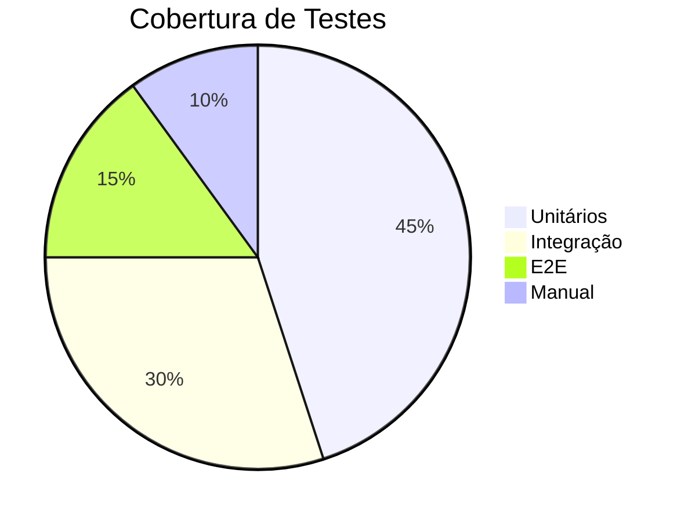
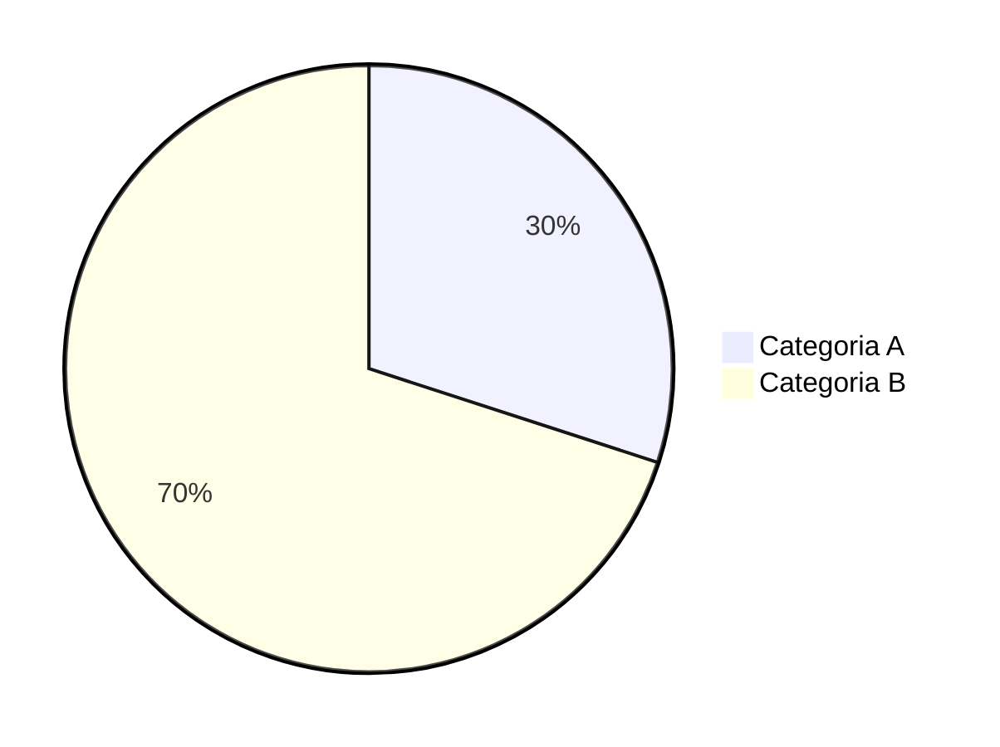
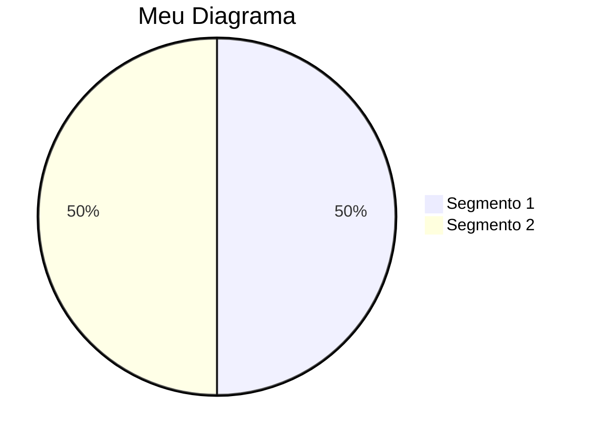
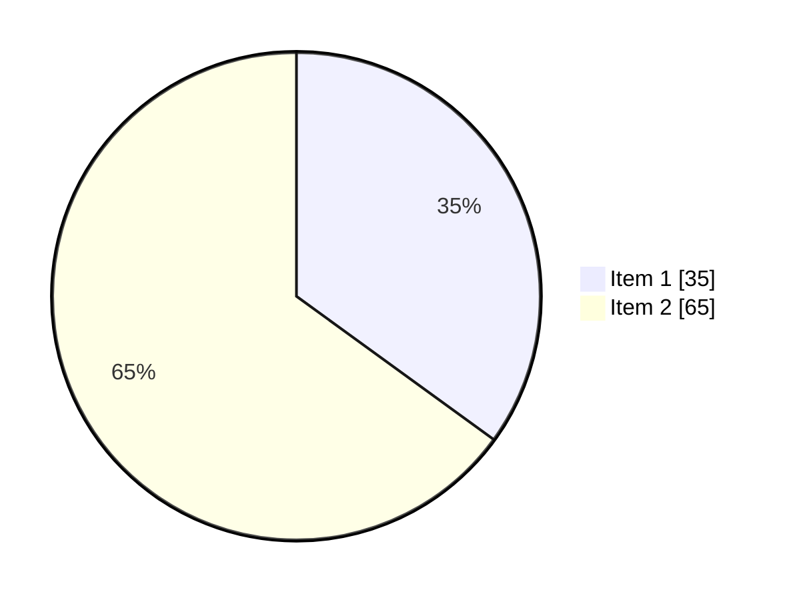
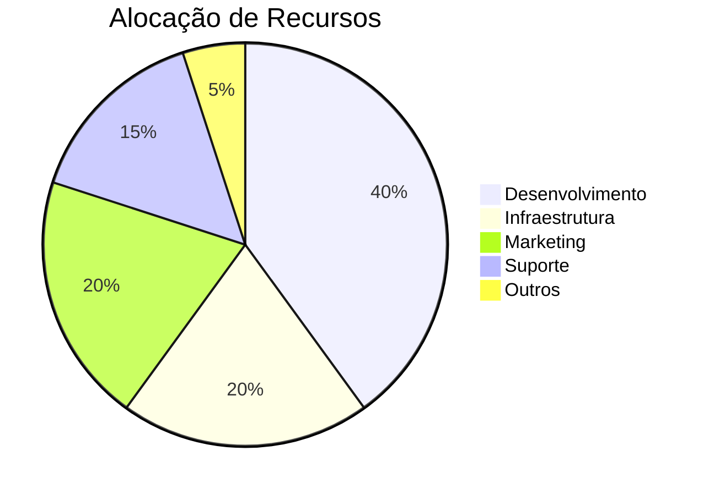
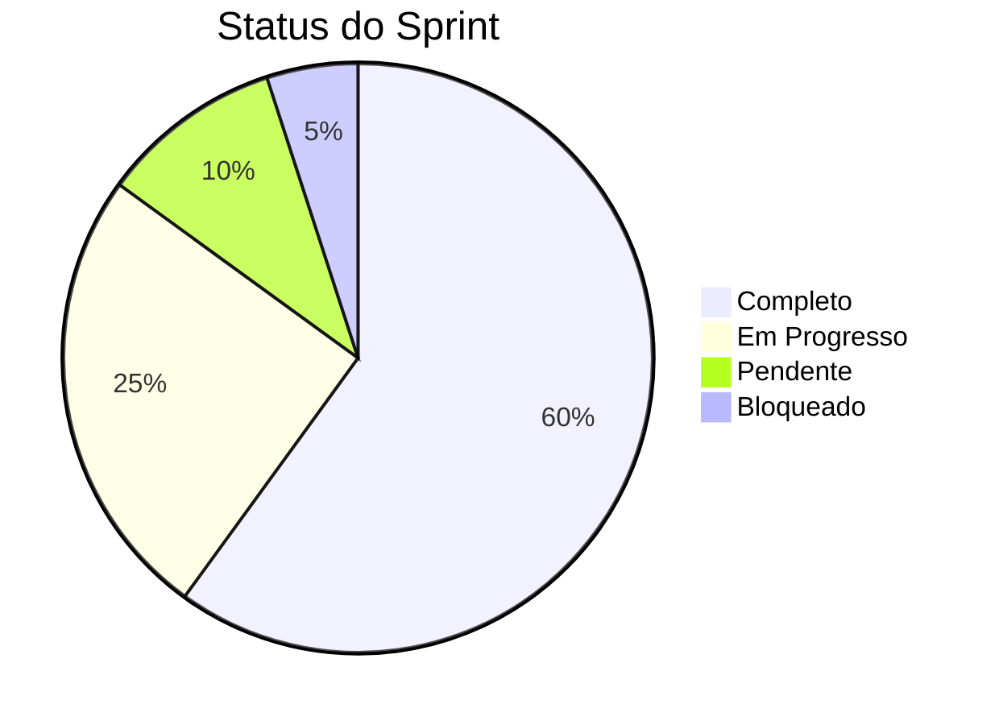
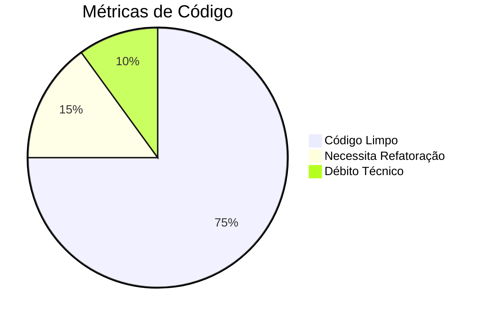

# Diagramas de Pizza com Mermaid

Os diagramas de pizza são úteis para visualizar distribuições e proporções de dados em formato circular.

## Exemplo Básico: Distribuição de Bugs por Severidade

## Exemplo Avançado: Distribuição de Tecnologias em um Projeto

## Exemplo com Valores Percentuais: Cobertura de Testes

## Sintaxe Básica

### Diagrama Simples

### Com Título

### Com Dados Visíveis

## Exemplos de Uso

### Distribuição de Recursos

### Status de Tarefas

### Métricas de Qualidade

## Boas Práticas

1. **Clareza**
   - Use títulos descritivos
   - Limite o número de segmentos
   - Ordene por relevância

2. **Dados**
   - Use valores precisos
   - Mostre dados quando relevante
   - Mantenha proporções realistas

3. **Visualização**
   - Use cores contrastantes
   - Mantenha legibilidade
   - Considere o contexto

4. **Uso Apropriado**
   - Para distribuições simples
   - Quando soma é 100%
   - Para comparações proporcionais

5. **Limitações**
   - Evite muitos segmentos
   - Não use para tendências
   - Não para comparações complexas 