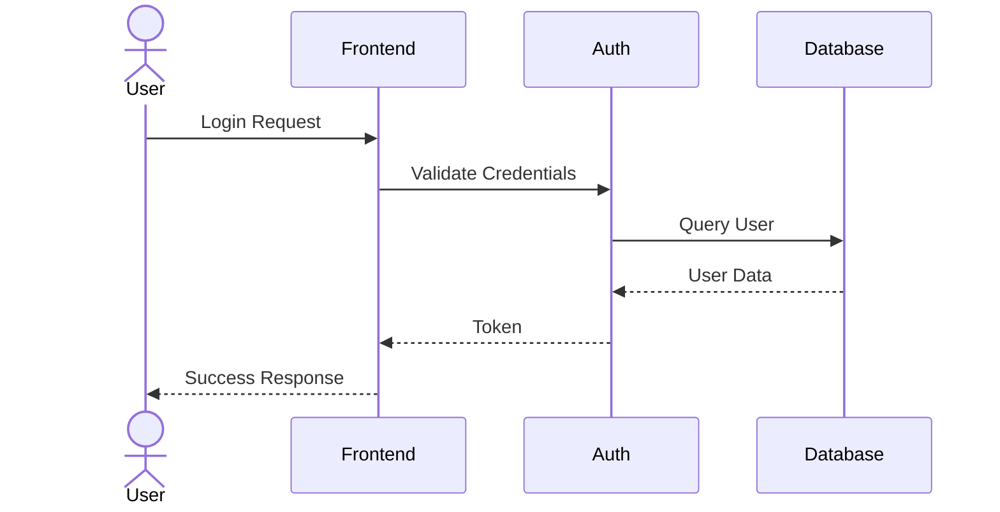
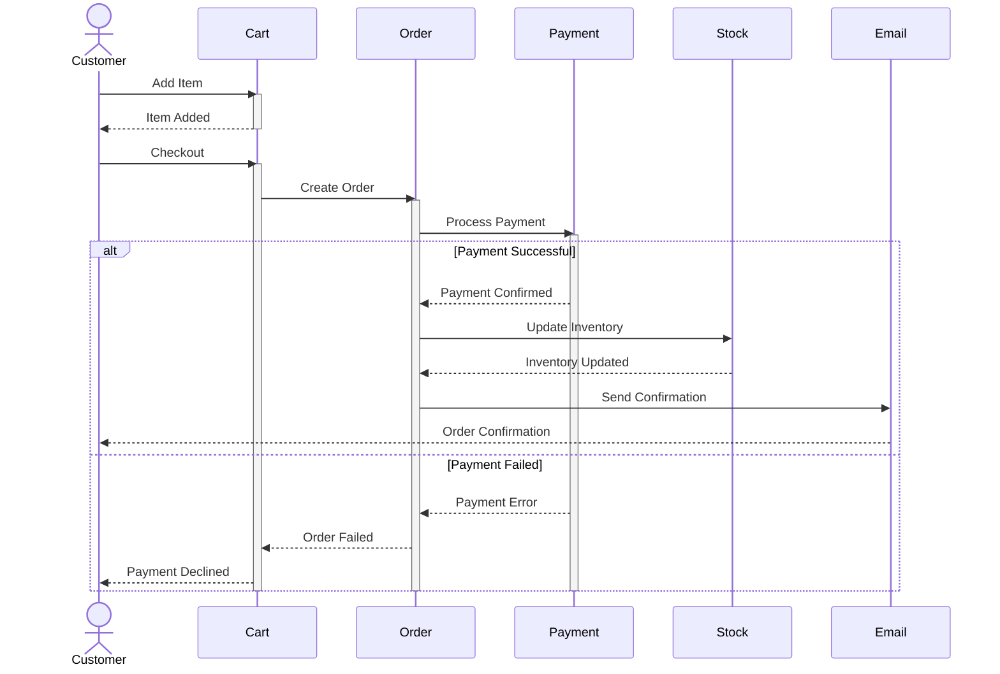
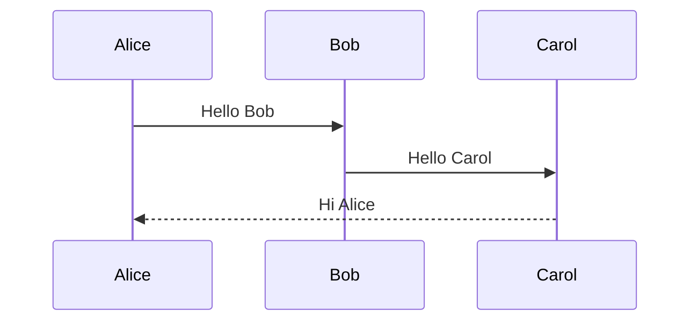
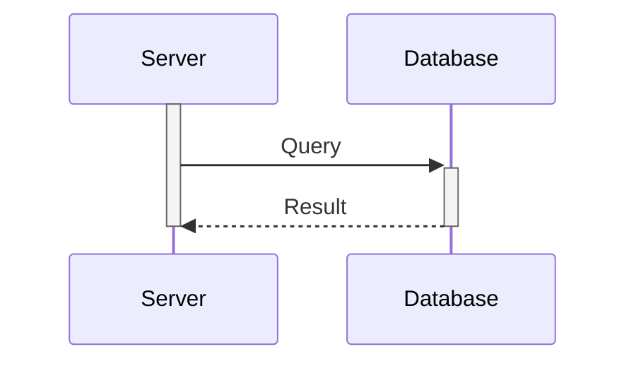
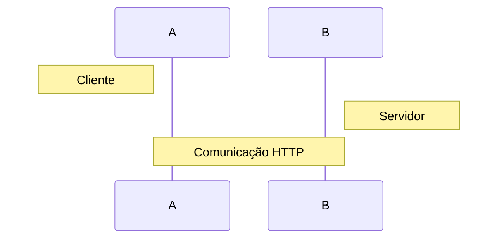
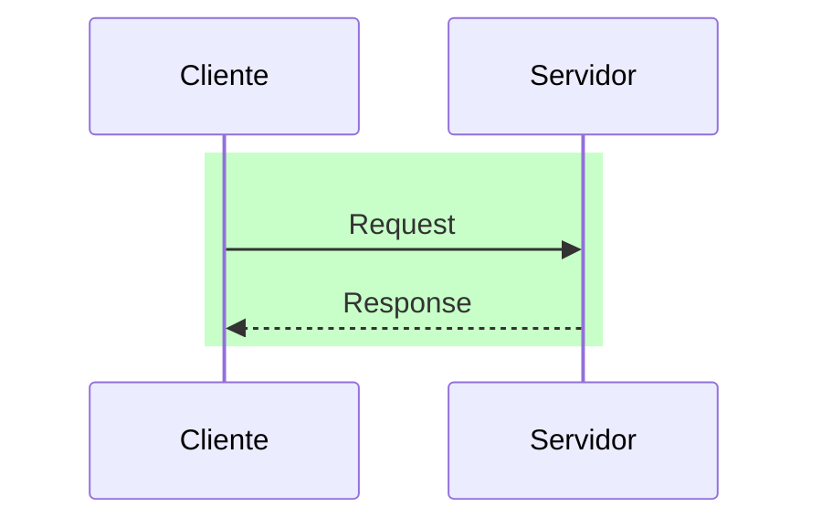

# Diagramas de Sequência com Mermaid

Os diagramas de sequência são excelentes para mostrar a interação entre diferentes componentes de um sistema ao longo do tempo. São particularmente úteis para documentar fluxos de comunicação e protocolos.

## Exemplo Básico: Autenticação de Usuário



## Exemplo Avançado: Processo de Compra



## Exemplo com Loops e Condicionais: Polling de Status

```mermaid
sequenceDiagram
    participant Client
    participant Server
    participant Worker

    Client->>Server: Start Job
    activate Server
    Server->>Worker: Queue Job
    Server-->>Client: Job ID
    deactivate Server

    loop Every 5 seconds
        Client->>Server: Check Status
        activate Server
        Server->>Worker: Get Progress
        Worker-->>Server: Progress Update
        alt Job Complete
            Server-->>Client: Result
            break
        else Job Failed
            Server-->>Client: Error
            break
        else In Progress
            Server-->>Client: Progress %
        end
        deactivate Server
    end
```

## Sintaxe Básica

### Participantes


### Tipos de Setas
```mermaid
sequenceDiagram
    A->>B: Seta sólida com ponta
    A-->B: Seta tracejada com ponta
    A--->B: Seta tracejada longa
    A-->>B: Seta tracejada com ponta dupla
    A-)B: Seta sólida com ponta aberta
    A--)B: Seta tracejada com ponta aberta
```

### Ativação e Desativação


## Recursos Avançados

### Notas


### Cores e Estilos


## Boas Práticas

1. **Clareza**
   - Use nomes descritivos para participantes
   - Mantenha mensagens concisas
   - Use notas para explicar detalhes complexos

2. **Organização**
   - Agrupe interações relacionadas
   - Use cores para destacar fluxos importantes
   - Mantenha um fluxo lógico de tempo

3. **Detalhamento**
   - Inclua tratamento de erros
   - Documente estados alternativos
   - Mostre ativação de participantes

4. **Legibilidade**
   - Evite muitos participantes
   - Use aliases para nomes longos
   - Mantenha o diagrama focado em um fluxo específico 