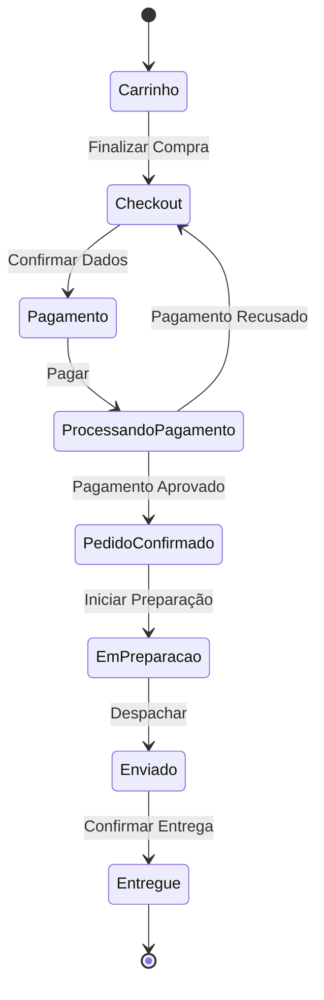
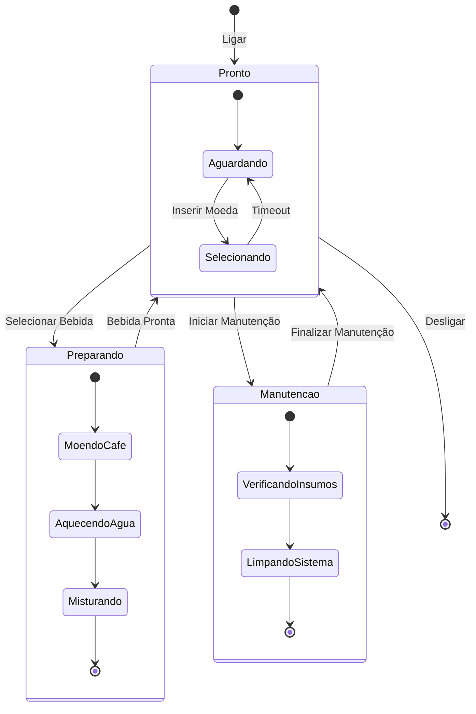
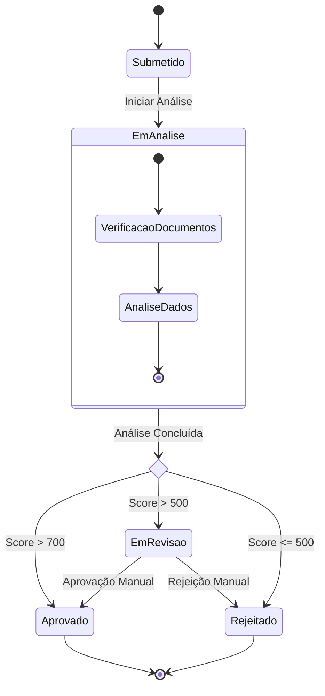
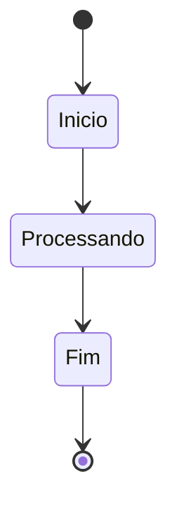
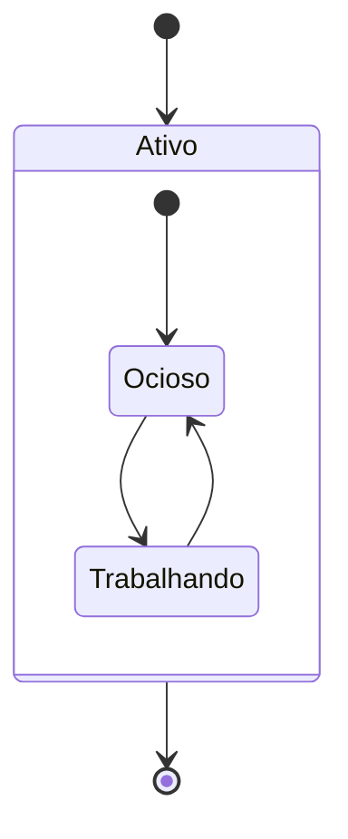
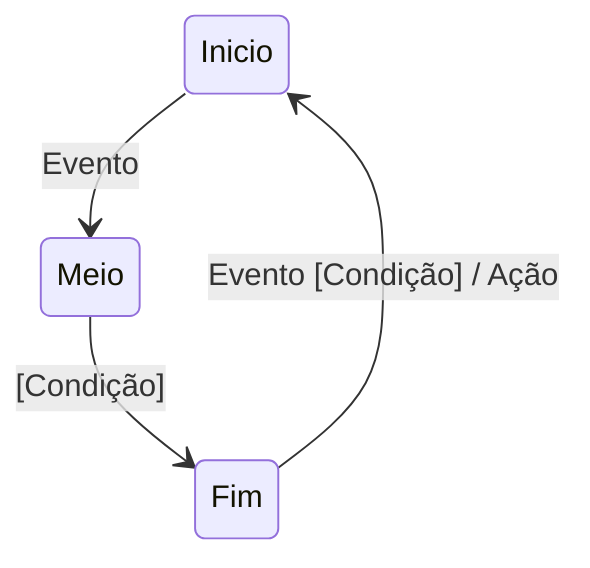
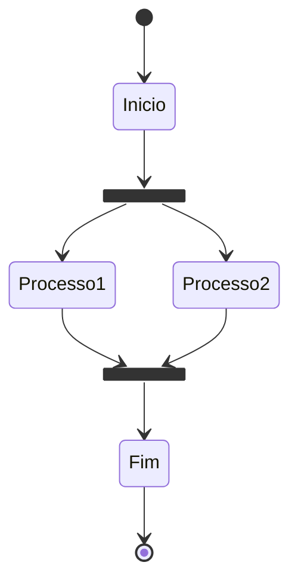
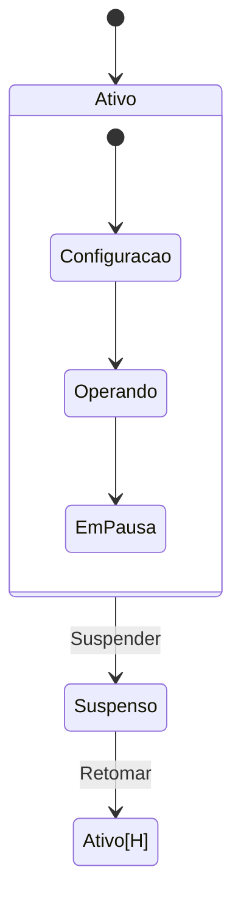

# Diagramas de Estado com Mermaid

Os diagramas de estado são úteis para modelar o comportamento de um sistema, mostrando como ele transita entre diferentes estados em resposta a eventos.

## Exemplo Básico: Pedido de E-commerce

## Exemplo Avançado: Máquina de Café

## Exemplo com Choice: Processo de Aprovação

## Sintaxe Básica

### Estados Simples

### Estados Compostos

### Transições

## Recursos Avançados

### Fork e Join

### História

## Boas Práticas

1. **Clareza**
   - Use nomes descritivos para estados
   - Mantenha transições claras
   - Documente condições importantes

2. **Organização**
   - Agrupe estados relacionados
   - Use estados compostos para simplificar
   - Mantenha o fluxo lógico

3. **Detalhamento**
   - Inclua eventos relevantes
   - Especifique condições
   - Documente ações importantes

4. **Legibilidade**
   - Evite muitas transições cruzadas
   - Use estados compostos para reduzir complexidade
   - Mantenha o diagrama focado

5. **Validação**
   - Verifique estados sem saída
   - Confirme estados iniciais e finais
   - Valide todas as transições possíveis 